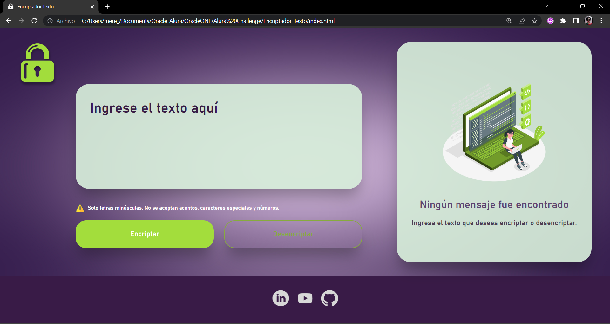
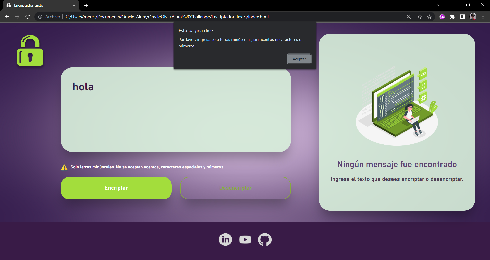
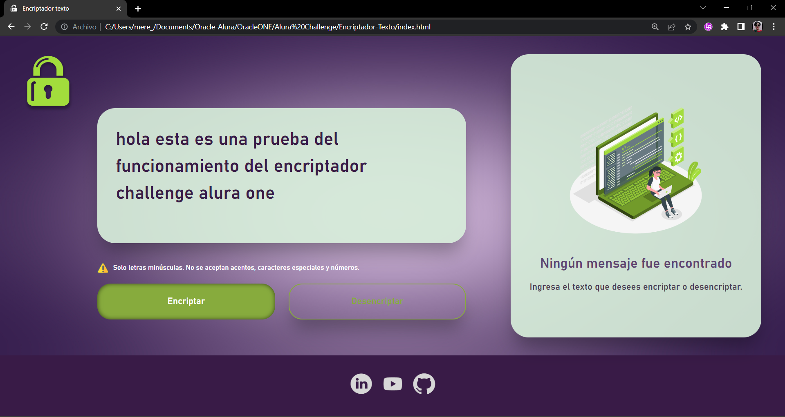
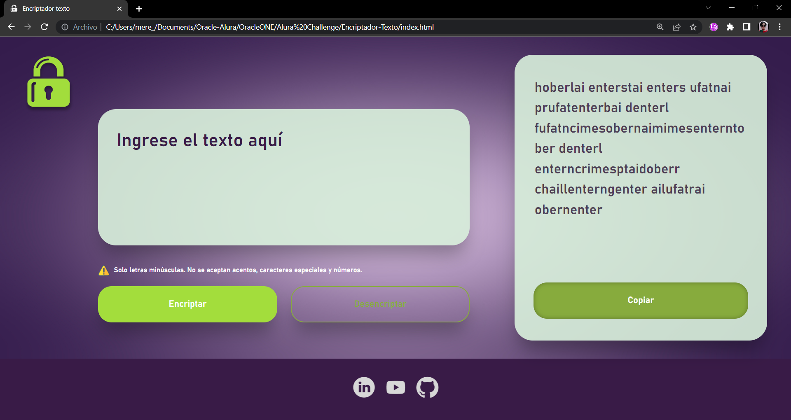
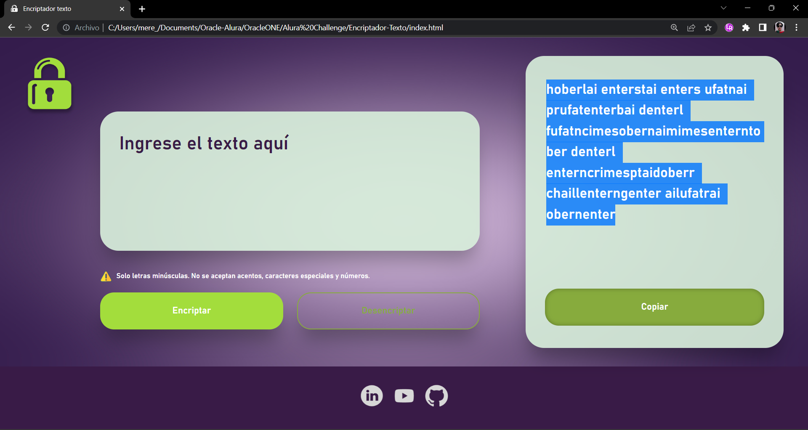
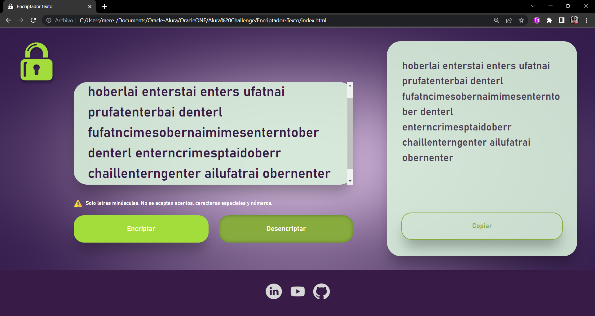
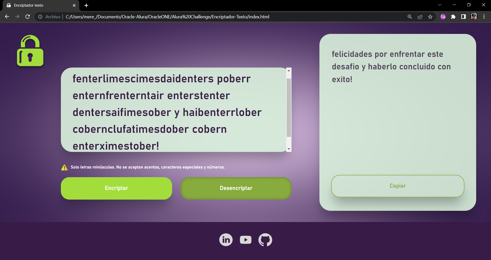

# Encriptador de texto - Alura Challenge 

Challenge Alura-ONE: Encriptador de texto 

## Descripción

Este sitio web permite encriptar y desencriptar texto utilizando las siguientes reglas de encriptación:

- La letra "e" es convertida para "enter"
- La letra "i" es convertida para "imes"
- La letra "a" es convertida para "ai"
- La letra "o" es convertida para "ober"
- La letra "u" es convertida para "ufat"

## Características

- Permite encriptar texto ingresado por el usuario.
- Permite desencriptar texto ingresado por el usuario.
- Funciona solo con letras minúsculas y no utiliza letras con acentos ni caracteres especiales.
- Permite copiar el texto encriptado o desencriptado al portapapeles.
- Permite convertir una palabra encriptada de vuelta a su versión original.
- El resultado de la encriptación o desencriptación se muestra en la pantalla.

## Uso

Para utilizar el encriptador de texto, sigue los siguientes pasos:

1. Ingresa el texto que deseas encriptar o desencriptar en el campo correspondiente.
2. Selecciona la opción "Encriptar" o "Desencriptar", según lo que deseas hacer.
3. Haz clic en el botón "Procesar".
4. El resultado de la encriptación o desencriptación se mostrará en la pantalla.
5. Si deseas copiar el resultado al portapapeles, haz clic en el botón "Copiar".

## Capturas de funcionamiento
        Captura de inicio

        Captura de prueba mensaje filtro

        Captura de mensaje a encriptar

        Captura de mensaje encriptado

        Captura de prueba botón copiar

        Captura de mensaje en portapapeles

        Captura de mensaje desencriptado

        Captura de mensaje secreto desencriptado Alura

## Herramientas

####   

## Limitaciones

Este sitio web solo funciona con texto en letras minúsculas y no utiliza letras con acentos ni caracteres especiales.

## Contribuciones

Si deseas contribuir al desarrollo de este sitio web, por favor envía tus sugerencias y mejoras a través de la sección de "Issues" en el repositorio de GitHub.

## Créditos

Este sitio web fue desarrollado por Meredith Moreno durante el proyecto Alura Latam One Challenge, turma 5. 

12/05/2023

